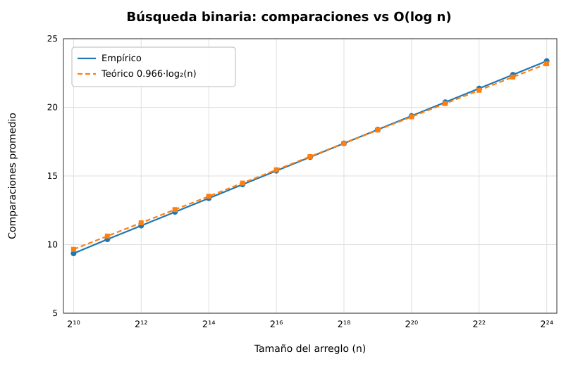
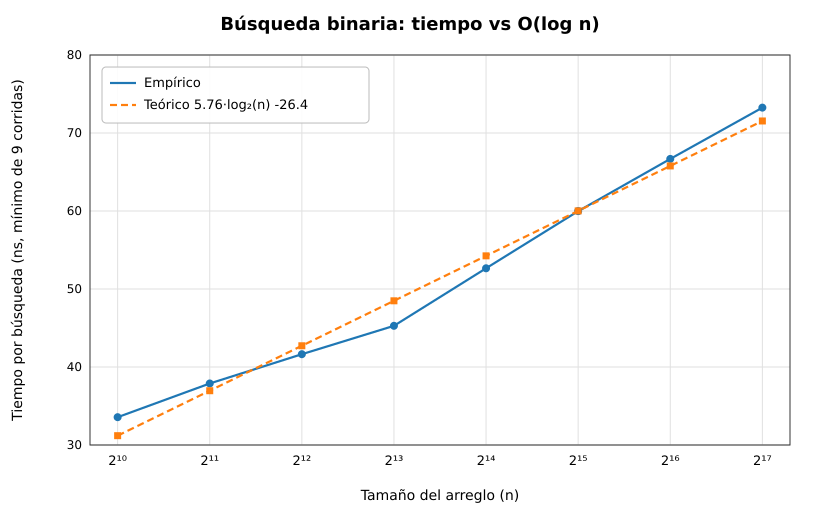
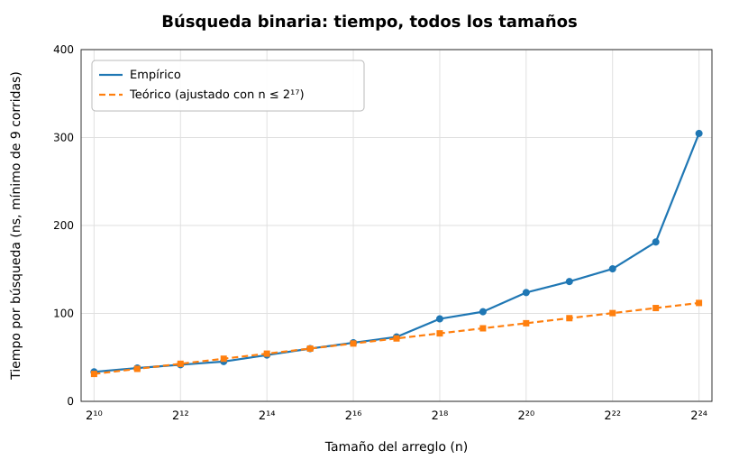
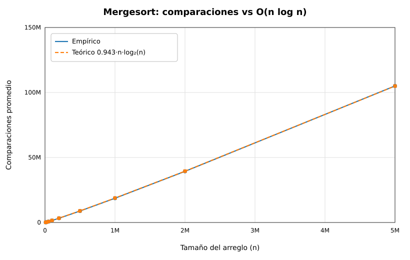
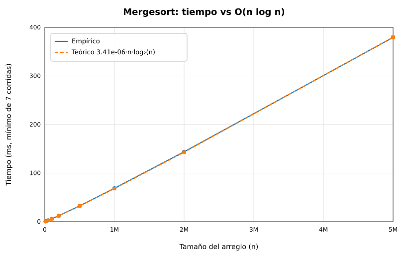
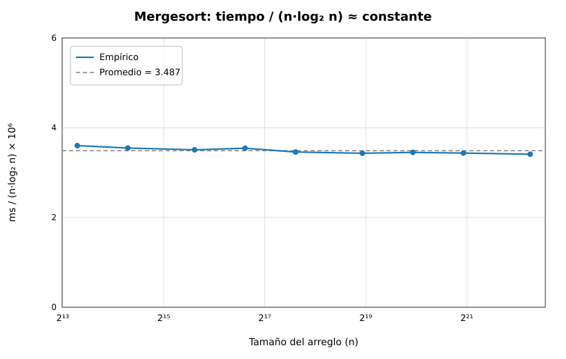

# Quiz #3  Análisis Empírico de Algoritmos

**Curso:** Algoritmos y Estructuras de Datos II (CE-2103) - II Semestre 2026
**Instituto Tecnológico de Costa Rica - Escuela de Ingeniería en Computadores**

## Contenido

1. Objetivo
2. Resultados: Búsqueda binaria
3. Resultados: Mergesort
4. Resumen general
5. Conclusión

## Objetivo

Demostrar de forma empírica, mediante benchmarks en C++, que:

| Algoritmo | Complejidad esperada |
|---|---|
| Búsqueda binaria | O(log n) |
| Mergesort | O(n log n) |

Para ello se ejecutan ambos algoritmos con arreglos aleatorios de distintos tamaños, se grafican los resultados y se comparan contra la curva del análisis teórico.

## Resultados: Búsqueda binaria - O(log n)

### Comparaciones vs. teórico

| Constante c | R² | Rango observado |
|:---:|:---:|:---:|
| 0.966 | 0.9987 | 9.4 comparaciones (n = 2^10) a 23.4 (n = 2^24) |

La curva empírica coincide con 0.966 * log2(n). Cada vez que el tamaño del arreglo se duplica, se agrega aproximadamente una comparación, que es el comportamiento logarítmico esperado.

### Tiempo vs. teórico (arreglos que caben en caché)

| Modelo ajustado | R² | Rango observado |
|:---:|:---:|:---:|
| 5.76 * log2(n) - 26.4 ns | 0.983 | 33.6 ns (n = 2^10) a 73.3 ns (n = 2^17) |

Al multiplicar el tamaño del arreglo por 128, el tiempo solo aumenta un factor de aproximadamente 2.2, lo que es característico de un crecimiento logarítmico.

### Tiempo con todos los tamaños

Con arreglos de varios MB (más allá de 2^17 elementos), los datos dejan de caber en la caché del procesador y cada acceso a memoria es mucho más lento. El tiempo llega a unos 305 ns en n = 2^24. Esto es un efecto de la jerarquía de memoria del hardware y no un cambio en la complejidad del algoritmo. La prueba es que el número de comparaciones sigue siendo log2(n) (gráfica de comparaciones), por lo que el algoritmo sigue siendo O(log n) en operaciones.

## Resultados: Mergesort - O(n log n)

### Comparaciones vs. teórico

| Constante c | R² | Dato destacado |
|:---:|:---:|:---:|
| 0.943 | 0.99999 | Aproximadamente 105 millones de comparaciones con n = 5,000,000 |

### Tiempo vs. teórico

| Constante c | R² | Dato destacado |
|:---:|:---:|:---:|
| 3.41e-06 ms | 0.99999 | Aproximadamente 379 ms para ordenar 5,000,000 de elementos |

### Razón tiempo / (n * log2 n)

Si el algoritmo es O(n log n), este cociente debe ser aproximadamente constante.

El cociente se mantiene entre 3.41 y 3.60 (multiplicado por 10^-6) para tamaños que van de 10,000 a 5,000,000 de elementos, con un promedio de 3.487. La razón es prácticamente plana, lo que confirma O(n log n).

### Comparación entre modelos

Se ajustaron los datos de Mergesort a tres funciones distintas (mayor R² indica mejor ajuste):

| Modelo | R² comparaciones | R² tiempo |
|:---:|:---:|:---:|
| n | 0.99851 | 0.99893 |
| n * log2(n) | 0.99999 | 0.99999 |
| n^2 | 0.91874 | 0.91508 |

El modelo n * log2(n) es el mejor ajuste en ambas métricas y n^2 queda claramente descartado.

## Resumen general

| Algoritmo | Métrica | Constante c | R² |
|---|---|:---:|:---:|
| Búsqueda binaria | Comparaciones | 0.966 | 0.9987 |
| Búsqueda binaria | Tiempo (n <= 2^17) | 5.76 ns | 0.983 |
| Mergesort | Comparaciones | 0.943 | 0.99999 |
| Mergesort | Tiempo | 3.41e-06 ms | 0.99999 |

Los datos crudos se encuentran en la carpeta `resultados/` y se pueden abrir en Excel.

## Conclusión

Los resultados empíricos confirman la complejidad teórica de ambos algoritmos:

- **Búsqueda binaria es O(log n).** El número de comparaciones sigue casi perfectamente la curva log2(n) (R² = 0.9987) y el tiempo real crece de forma logarítmica mientras el arreglo cabe en caché (R² = 0.983). La desviación en tamaños muy grandes se explica por fallos de caché, un efecto del hardware.
- **Mergesort es O(n log n).** Tanto las comparaciones como el tiempo se ajustan a n * log2(n) con R² = 0.99999, la razón tiempo / (n * log2 n) es casi constante y el modelo n^2 queda descartado (R² cercano a 0.92).